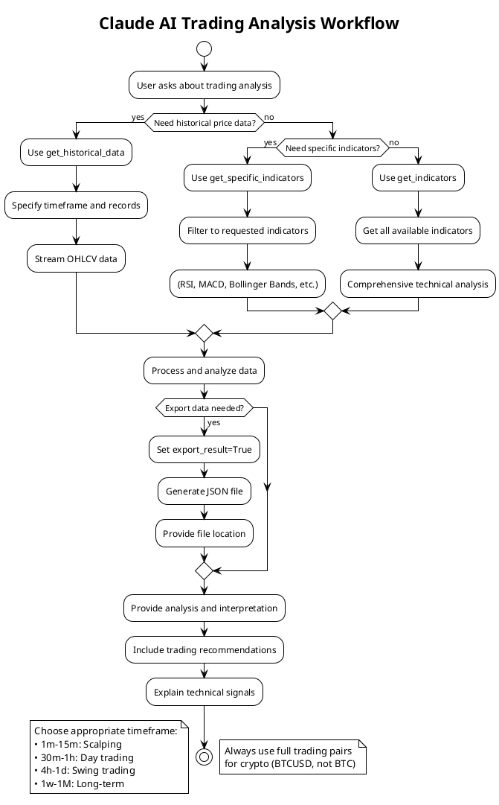

# Claude MCP TradingView Server Documentation

This document provides guidance for Claude AI when working with the MCP TradingView Server.

## Overview

This MCP server provides access to TradingView technical indicators and historical data through three main tools:
- `get_indicators`: Fetches all technical indicators for a trading symbol
- `get_specific_indicators`: Retrieves specific named indicators
- `get_historical_data`: Collects real-time OHLCV (candlestick) data

## Claude Workflow



## Available Tools

### 1. get_indicators
Retrieves all available technical indicators for a given symbol.

**Parameters:**
- `symbol` (required): Trading symbol (e.g., "BTCUSD", "AAPL", "EURUSD")
- `exchange` (optional): Exchange name (default: "BINANCE")
- `timeframe` (optional): Chart timeframe (default: "1h")
- `all_indicators` (optional): Whether to fetch all indicators (default: true)
- `export_result` (optional): Export to JSON file (default: false)

**Example usage:**
```python
await get_indicators("BTCUSD", exchange="BINANCE", timeframe="4h")
```

### 2. get_specific_indicators
Retrieves specific technical indicators by name.

**Parameters:**
- `symbol` (required): Trading symbol
- `indicators` (required): List of indicator names to fetch (e.g., ["RSI", "MACD", "BB"])
- `exchange` (optional): Exchange name (default: "BINANCE")
- `timeframe` (optional): Chart timeframe (default: "1h")
- `export_result` (optional): Export to JSON file (default: false)

**Example usage:**
```python
await get_specific_indicators("AAPL", indicators=["RSI", "MACD.macd", "EMA20"], exchange="NASDAQ")
```

### 3. get_historical_data
Retrieves real-time OHLCV (Open, High, Low, Close, Volume) data stream for a given symbol and converts it to the requested timeframe.

**Parameters:**
- `symbol` (required): Trading symbol (e.g., "BTCUSD", "AAPL")
- `exchange` (optional): Exchange name (default: "BINANCE")
- `timeframe` (optional): Timeframe for candles (default: "1h") - Options: "1m", "5m", "15m", "30m", "1h", "2h", "4h", "1d", "1w", "1M"
- `max_records` (optional): Maximum number of OHLC records to collect in the requested timeframe (default: 100)
- `export_result` (optional): Export to JSON file (default: false)

**Example usage:**
```python
await get_historical_data("BTCUSD", exchange="BINANCE", timeframe="4h", max_records=50)
```

**How it works**: 
- Uses TradingView's native Streamer class which supports timeframes directly
- Efficiently requests data in your specified timeframe without over-collecting
- The streaming connection provides real-time OHLCV data
- Data is automatically aggregated to the requested timeframe by the underlying library

**Data structure**: Each candle includes:
- `timestamp`: Unix timestamp of the candle
- `open`: Opening price
- `high`: Highest price in the period
- `low`: Lowest price in the period
- `close`: Closing price
- `volume`: Total trading volume in the period
- `index`: Candle index
- Additional metadata from the stream

## Available Resources

### indicators/{symbol}
Returns formatted text output of current indicator values for a symbol.

**Example:** `indicators/BTCUSD`

## Supported Exchanges

Common exchanges include:
- Crypto: BINANCE, COINBASE, KRAKEN, BYBIT, KUCOIN, OKX
- Stock: NASDAQ, NYSE, AMEX
- Forex: FX, OANDA
- And many more available on TradingView

## Supported Timeframes

- Minutes: 1m, 5m, 15m, 30m
- Hours: 1h, 4h
- Days: 1d
- Weeks: 1w
- Months: 1M

## Available Indicators

The server returns a comprehensive set of technical indicators. When using `get_specific_indicators`, you can request any of these by their key names:

### Moving Averages
- `EMA10`, `EMA20`, `EMA30`, `EMA50`, `EMA100`, `EMA200`: Exponential Moving Averages
- `SMA10`, `SMA20`, `SMA30`, `SMA50`, `SMA100`, `SMA200`: Simple Moving Averages
- `HullMA9`: Hull Moving Average
- `VWMA`: Volume Weighted Moving Average

### Momentum Indicators
- `RSI`: Relative Strength Index (current and [1] for previous)
- `Stoch.K`, `Stoch.D`: Stochastic Oscillator K and D values
- `Stoch.RSI.K`: Stochastic RSI
- `CCI20`: Commodity Channel Index
- `Mom`: Momentum indicator
- `UO`: Ultimate Oscillator
- `W.R`: Williams %R

### Trend Indicators
- `ADX`: Average Directional Index
- `ADX+DI`, `ADX-DI`: Directional Movement indicators
- `MACD.macd`, `MACD.signal`: MACD line and signal line
- `AO`: Awesome Oscillator

### Other Indicators
- `BBPower`: Bollinger Bands Power
- `Ichimoku.BLine`: Ichimoku Base Line
- `close`: Current close price

### Pivot Points
Multiple pivot point calculations are available:
- `Pivot.M.Classic.*`: Classic pivot points (R1-R3, S1-S3, Middle)
- `Pivot.M.Fibonacci.*`: Fibonacci pivot points
- `Pivot.M.Camarilla.*`: Camarilla pivot points
- `Pivot.M.Woodie.*`: Woodie's pivot points
- `Pivot.M.Demark.*`: Demark pivot points

### Recommendations
- `Recommend.All`: Overall recommendation score
- `Recommend.MA`: Moving average recommendation
- `Recommend.Other`: Other indicators recommendation
- `Rec.*`: Individual indicator recommendations (BBPower, HullMA9, Ichimoku, etc.)

**Note**: Historical values are available using `[1]`, `[2]` suffixes for previous periods.

## Usage Guidelines

1. **Symbol Format**: Use standard TradingView symbol notation
   - Crypto: Use full trading pairs like "BTCUSD", "ETHUSD", "SOLUSDT", "EGLDUSDT" (not just "EGLD")
   - Stocks: "AAPL", "TSLA", "MSFT"
   - Forex: "EURUSD", "GBPUSD"
   - Note: Single asset symbols without a quote currency (e.g., "EGLD", "BTC") will fail

2. **Exchange Selection**: Choose the appropriate exchange for accurate data
   - For crypto, BINANCE is usually a good default
   - For US stocks, use NASDAQ or NYSE
   - For forex, use FX or OANDA

3. **Timeframe Selection**: Match timeframe to analysis needs
   - Scalping: 1m, 5m
   - Day trading: 15m, 30m, 1h
   - Swing trading: 4h, 1d
   - Long-term: 1w, 1M

4. **Error Handling**: The tools return success/error status
   - Check the "success" field in responses
   - Error messages are provided in the "error" field

## Example Prompts

When users ask about technical indicators or historical data, you can use these patterns:

1. "What are the indicators for Bitcoin?"
   → Use `get_indicators("BTCUSD")`

2. "Show me the RSI and MACD for Apple stock"
   → Use `get_specific_indicators("AAPL", indicators=["RSI", "MACD.macd", "MACD.signal"], exchange="NASDAQ")`

3. "Get 4-hour chart indicators for Ethereum"
   → Use `get_indicators("ETHUSD", timeframe="4h")`

4. "Get historical price data for Bitcoin"
   → Use `get_historical_data("BTCUSD", max_records=100)`

5. "Collect OHLCV data for Tesla and save to file"
   → Use `get_historical_data("TSLA", exchange="NASDAQ", max_records=200, export_result=True)`

6. "Stream real-time candlestick data for EURUSD"
   → Use `get_historical_data("EURUSD", exchange="FX", max_records=50)`

## Best Practices

1. Always specify the exchange when known for more accurate data
2. Use appropriate timeframes based on the user's trading style
3. When users ask for "analysis", provide both the raw indicators and interpretation
4. For crypto pairs, default to BINANCE unless specified otherwise
5. For specific indicators, use get_specific_indicators to reduce data overhead
6. For historical price data, get_historical_data efficiently streams data in the requested timeframe
7. Use full trading pairs for crypto (e.g., "BTCUSD", not "BTC") to avoid API errors

## Limitations

- The server fetches real-time data from TradingView
- Some exotic symbols or exchanges might not be available
- Data accuracy depends on TradingView's data feed
- Rate limiting may apply for excessive requests

## Testing

To verify the server is working:
```
get_indicators("BTCUSD", exchange="BINANCE", timeframe="1h")
```

This should return a comprehensive set of technical indicators for Bitcoin.