# MCP TradingView Server

An MCP (Model Context Protocol) server that provides access to TradingView technical indicators using the tradingview_scraper library.

## Architecture

```mermaid
graph TB
    Claude[Claude Desktop] --> MCP[FastMCP Server]
    
    subgraph Server["MCP TradingView Server"]
        MCP --> Tools[Tools]
        MCP --> Resources[Resources]
        
        subgraph Tools
            GI[get_indicators]
            GSI[get_specific_indicators]
            GHD[get_historical_data]
        end
        
        subgraph Resources
            RES[indicators/{symbol}]
        end
    end
    
    subgraph Library["TradingView Scraper Library"]
        Ind[Indicators]
        Stream[Streamer]
        Converter[OHLCVConverter]
    end
    
    subgraph TV["TradingView API"]
        TechInd[(Technical Indicators)]
        OHLCV[(Real-time OHLCV Data)]
    end
    
    subgraph Export["Export Directory"]
        JSON[JSON Files]
    end
    
    Tools --> Ind
    Tools --> Stream
    Stream --> Converter
    Ind --> TechInd
    Stream --> OHLCV
    Tools --> JSON
    
    classDef cloud fill:#e1f5fe
    classDef database fill:#f3e5f5
    classDef file fill:#e8f5e8
    classDef component fill:#fff3e0
    
    class TV cloud
    class TechInd,OHLCV database
    class JSON file
    class Server,Library,Tools,Resources component
```

> **Note**: The Streamer class provides native timeframe support, avoiding over-collection of data. The OHLCVConverter efficiently aggregates 1-minute data to requested timeframes when needed.

## Features

- Fetch all technical indicators for any trading symbol
- Retrieve specific indicators by name
- Collect real-time OHLCV (candlestick) data with native timeframe support
- Support for multiple exchanges and all major timeframes (1m to 1M)
- Efficient data streaming using TradingView's native Streamer class
- Resource-based access to indicator data
- Export data to JSON files

## Installation

### Prerequisites

- Python 3.8 or higher
- uv (recommended for fast Python package and environment management)

### Setup with uv

1. **Install uv** (if not already installed):
   ```bash
   # macOS/Linux
   curl -LsSf https://astral.sh/uv/install.sh | sh
   
   # Or with Homebrew
   brew install uv
   
   # Windows
   powershell -c "irm https://astral.sh/uv/install.ps1 | iex"
   ```

2. **Create and setup the project**:
   ```bash
   # Navigate to the project directory
   cd /path/to/mcp-tradingview-server
   
   # Create a virtual environment with Python 3.11
   uv venv --python 3.11
   
   # Activate the environment (optional, uv can work without activation)
   source .venv/bin/activate  # On Windows: .venv\Scripts\activate
   ```

3. **Install the package**:
   ```bash
   # Install in development mode with uv
   uv pip install -e .
   
   # Or install dependencies directly
   uv pip install mcp tradingview-scraper
   ```

## MCP Server Configuration

### Claude Desktop Setup

1. **Locate Claude Desktop configuration**:
   - macOS: `~/Library/Application Support/Claude/claude_desktop_config.json`
   - Windows: `%APPDATA%\Claude\claude_desktop_config.json`
   - Linux: `~/.config/Claude/claude_desktop_config.json`

2. **Edit the configuration file**:
   ```json
   {
     "mcpServers": {
       "tradingview": {
         "command": "/path/to/mcp-tradingview-server/.venv/bin/python",
         "args": ["/path/to/mcp-tradingview-server/src/tradingview_server.py"],
         "cwd": "/path/to/mcp-tradingview-server"
       }
     }
   }
   ```

   **Important**: 
   - Replace `/path/to/mcp-tradingview-server` with the ABSOLUTE path to this project
   - Use absolute paths only (e.g., `/Users/username/projects/mcp-tradingview-server`)
   - Do NOT use `~` or relative paths as Claude Desktop won't expand them

3. **Alternative configuration using uv (requires full path)**:
   ```json
   {
     "mcpServers": {
       "tradingview": {
         "command": "/Users/username/.local/bin/uv",
         "args": ["run", "python", "-m", "tradingview_server"],
         "cwd": "/path/to/mcp-tradingview-server/src"
       }
     }
   }
   ```
   
   **Note**: You must use the full path to uv (find it with `which uv` in terminal)

4. **Restart Claude Desktop** after updating the configuration.

### Verifying the Setup

1. **Test the server locally**:
   ```bash
   cd /path/to/mcp-tradingview-server
   python test_server.py
   ```
   
   This will test all available functions:
   - Technical indicators retrieval
   - Specific indicators filtering
   - Resource-based access
   - Historical OHLCV data with different timeframes
   - Data export functionality

2. **Check server is running in Claude**:
   - Open Claude Desktop
   - Look for "tradingview" in the available MCP servers
   - Try using the tools with example prompts below

## Usage

### Example Prompts for Claude Desktop

Once configured, you can use these prompts in Claude Desktop:

**Basic Indicators:**
- "Get Bitcoin indicators using the tradingview server"
- "Show me all technical indicators for AAPL"
- "What are the current indicators for EURUSD?"

**Specific Indicators:**
- "Fetch RSI and MACD for Tesla using the tradingview tool"
- "Get the RSI, Stochastic, and Bollinger Bands for BTCUSD"
- "Show me momentum indicators for ETHUSD"

**With Timeframes:**
- "Get 4-hour indicators for Bitcoin on Binance"
- "Show daily indicators for SPY on NYSE"
- "Fetch 15-minute indicators for GBPUSD"

**Historical Data:**
- "Get historical OHLC data for Bitcoin"
- "Collect 200 candlesticks for Tesla and save to file"
- "Stream real-time price data for EURUSD"
- "Get OHLCV data for Ethereum on Binance"

**Technical Analysis:**
- "Analyze SOLUSDT using tradingview indicators on the 1-hour timeframe"
- "What do the technical indicators say about MSFT?"
- "Get indicators for gold (XAUUSD) and interpret them"

### Tool Interaction Overview

```mermaid
graph TD
    User[👤 Trader/Analyst] --> TA[📊 Technical Analysis]
    User --> HD[📈 Historical Data]
    User --> RA[⚡ Resource Access]
    
    subgraph Tools["🛠️ MCP Tools"]
        GI[get_indicators]
        GSI[get_specific_indicators]
        GHD[get_historical_data]
        Resource[indicators/{symbol}]
    end
    
    subgraph Sources["📡 Data Sources"]
        TVTI[(TradingView<br/>Technical Indicators)]
        TVRT[(TradingView<br/>Real-time Stream)]
    end
    
    subgraph Outputs["📤 Output Formats"]
        JSON[📄 JSON Export]
        Console[🖥️ Console Output]
        MCP_OUT[📋 MCP Response]
    end
    
    TA --> GI
    TA --> GSI
    HD --> GHD
    RA --> Resource
    
    GI --> TVTI
    GSI --> TVTI
    GHD --> TVRT
    Resource --> TVTI
    
    GI --> Console
    GSI --> Console
    GHD --> JSON
    GHD --> Console
    Resource --> MCP_OUT
    
    classDef userAction fill:#e3f2fd
    classDef tool fill:#f3e5f5
    classDef source fill:#e8f5e8
    classDef output fill:#fff3e0
    
    class TA,HD,RA userAction
    class GI,GSI,GHD,Resource tool
    class TVTI,TVRT source
    class JSON,Console,MCP_OUT output
```

> **Key Features:**
> - **GHD (get_historical_data)**: Supports all timeframes (1m, 5m, 15m, 30m, 1h, 2h, 4h, 1d, 1w, 1M)
> - **GSI (get_specific_indicators)**: Efficient filtering - only requested indicators returned
> - **TVRT**: WebSocket streaming for real-time data with native timeframe support

### Available Tools

#### `get_indicators`
Retrieve all technical indicators for a symbol.

Parameters:
- `symbol` (required): Trading symbol - Must be a complete trading pair (e.g., "BTCUSD", "EGLDUSDT", "AAPL")
  - For crypto: Use full pairs like "BTCUSD", not just "BTC"
  - For stocks: Ticker symbols work (e.g., "AAPL", "TSLA")
- `exchange`: Exchange name (default: "BINANCE")
- `timeframe`: Timeframe (default: "1h") - Options: "1m", "5m", "15m", "30m", "1h", "4h", "1d", "1w", "1M"
- `all_indicators`: Fetch all indicators (default: true)
- `export_result`: Export to JSON file (default: false)

#### `get_specific_indicators`
Retrieve specific indicators for a symbol.

Parameters:
- `symbol` (required): Trading symbol
- `indicators` (required): List of indicators to fetch (e.g., ["RSI", "MACD", "BB"])
- `exchange`: Exchange name (default: "BINANCE")
- `timeframe`: Timeframe (default: "1h")
- `export_result`: Export to JSON file (default: false)

#### `get_historical_data`
Retrieve real-time OHLCV (Open, High, Low, Close, Volume) data stream with automatic timeframe conversion.

Parameters:
- `symbol` (required): Trading symbol (e.g., "BTCUSD", "AAPL")
- `exchange`: Exchange name (default: "BINANCE")
- `timeframe`: Timeframe for candles (default: "1h") - Options: "1m", "5m", "15m", "30m", "1h", "2h", "4h", "1d", "1w", "1M"
- `max_records`: Maximum number of OHLC records to collect in the requested timeframe (default: 100)
- `export_result`: Export to JSON file (default: false)

**How it works**: Uses TradingView's native Streamer class to efficiently collect data in your specified timeframe directly, without needing to over-collect and convert data.

### Historical Data Flow

```mermaid
sequenceDiagram
    participant Claude as Claude Desktop
    participant Tool as get_historical_data
    participant Stream as Streamer
    participant Converter as OHLCVConverter
    participant WS as TradingView WebSocket
    participant Export as Export Directory

    Claude->>+Tool: get_historical_data(<br/>symbol="BTCUSD",<br/>timeframe="4h",<br/>max_records=10)
    
    Tool->>+Stream: Streamer(export_result=True)
    
    Stream->>+Converter: OHLCVConverter(target_timeframe="4h")
    Converter-->>-Stream: timeframe validation ✓
    
    Stream->>+WS: WebSocket connection
    Stream->>WS: create_series(timeframe="1m", records=10)
    WS-->>-Stream: 1-minute OHLCV data stream
    
    Stream->>+Converter: convert(1m_data, target="4h")
    Note over Converter: Efficiently aggregates:<br/>• High = max(highs)<br/>• Low = min(lows)<br/>• Open = first open<br/>• Close = last close<br/>• Volume = sum(volumes)
    Converter-->>-Stream: aggregated 4h candles
    
    alt export_result=true
        Stream->>+Export: save JSON file
        Export-->>-Stream: file saved
    end
    
    Stream-->>-Tool: {"ohlc": [...], "indicator": [...]}
    
    Tool-->>-Claude: {<br/>"success": true,<br/>"timeframe": "4h",<br/>"records_collected": 10,<br/>"data": [...],<br/>"export_file": "..."<br/>}
    
    Note over WS: Real-time streaming<br/>avoids historical API limits
```



Returns:
- `success`: Operation status
- `symbol`: Trading symbol
- `exchange`: Exchange name  
- `timeframe`: The timeframe of the returned data
- `records_collected`: Number of records in the requested timeframe
- `data`: Array of OHLCV candles
- `export_file`: Export filename (if exported)

### Available Resources

- `indicators/{symbol}`: Get current indicator values as a formatted text resource

## Example Usage

```python
# Get all indicators for Bitcoin
result = await get_indicators("BTCUSD", exchange="BINANCE", timeframe="4h")

# Get specific indicators
result = await get_specific_indicators(
    "AAPL", 
    indicators=["RSI", "MACD"], 
    exchange="NASDAQ"
)

# Get historical OHLCV data
result = await get_historical_data(
    "BTCUSD",
    exchange="BINANCE",
    timeframe="4h",  # Will collect 1m data and convert to 4h candles
    max_records=50,
    export_result=True
)
```

## Claude AI Integration

This MCP server includes a `CLAUDE.md` file that provides detailed documentation for Claude AI, including:
- Tool usage examples
- Best practices for indicator analysis
- Common prompt patterns
- Exchange and timeframe recommendations

When using this server with Claude Desktop, Claude will automatically reference this documentation to provide better assistance with technical analysis.

## Supported Exchanges

The server supports all exchanges available in TradingView, including:
- BINANCE
- COINBASE
- KRAKEN
- NASDAQ
- NYSE
- And many more...

## Timeframes

- 1m, 5m, 15m, 30m (minutes)
- 1h, 4h (hours)
- 1d (daily)
- 1w (weekly)
- 1M (monthly)

## Troubleshooting

### Common Issues

1. **"spawn python ENOENT" or "spawn uv ENOENT" error**:
   - This means Claude Desktop can't find the command in its PATH
   - Solution: Use ABSOLUTE paths in your configuration
   - Example: Instead of `"command": "python"`, use `"command": "/Users/yourname/project/.venv/bin/python"`
   - Find the correct path by running `which python` or `pwd` in your project directory

2. **"Module not found" error**:
   - Ensure you're in the correct directory with the `.venv`
   - Verify installation with: `uv pip list | grep tradingview`

3. **MCP server not showing in Claude**:
   - Check the configuration file path is correct
   - Ensure ALL paths in the config are absolute (no `~` or relative paths)
   - Restart Claude Desktop after configuration changes

4. **Permission errors**:
   - Make sure the Python script is executable: `chmod +x src/tradingview_server.py`

### Debug Mode

To run the server in debug mode for troubleshooting:
```bash
cd /path/to/mcp-tradingview-server
uv run python -m tradingview_server

# Or with activated environment
source .venv/bin/activate
python -m tradingview_server
```

## Contributing

Feel free to submit issues and enhancement requests!

## License

This project is provided as-is for educational and research purposes.